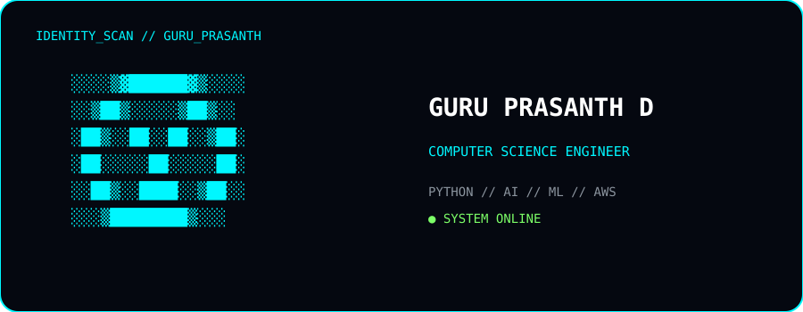
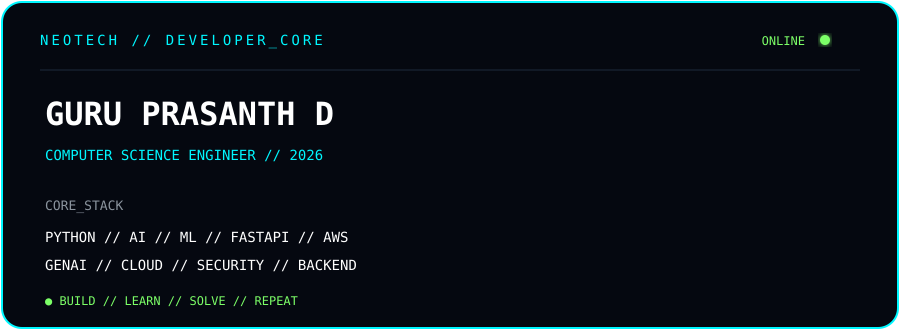

<div align="center">

<h1>GURU PRASANTH D</h1>


<br><br>



<br><br>



</div>

## `> whoami`

```bash
guru@github:~$ whoami

Name        : Guru Prasanth D
Role        : Computer Science Engineer
Primary     : Python
Focus       : AI / ML • Generative AI • Backend
Cloud       : AWS
Status      : OPEN TO OPPORTUNITIES
```

## `> current_mission`

```text
Building intelligent, secure and scalable systems
that solve real-world problems.
```

## `> technology.matrix`

<div align="center">


</div>


# `> github.telemetry`

<div align="center">


</div>

<div align="center">


</div>
# `> contribution.matrix`

<div align="center">

<picture>

<source
media="(prefers-color-scheme: dark)"
srcset="https://raw.githubusercontent.com/GuruPrasanthD/GuruPrasanthD/output/github-contribution-grid-snake-dark.svg"
/>

<source
media="(prefers-color-scheme: light)"
srcset="https://raw.githubusercontent.com/GuruPrasanthD/GuruPrasanthD/output/github-contribution-grid-snake.svg"
/>


</picture>

</div>

# `> developer.py`

```python
class GuruPrasanth:

    def __init__(self):

        self.role = "Computer Science Engineer"

        self.primary_language = "Python"

        self.focus = [
            "Artificial Intelligence",
            "Machine Learning",
            "Generative AI",
            "Backend Engineering",
            "Cloud Computing",
            "Cybersecurity"
        ]

    def mission(self):

        return "Build. Learn. Solve. Repeat."


developer = GuruPrasanth()

print(developer.mission())
```

```text
OUTPUT >

Build. Learn. Solve. Repeat.
```

# `> network.connect`

<div align="center">

<a href="https://github.com/GuruPrasanthD">

</a>

<a href="YOUR_LINKEDIN_URL">

</a>

</div>
